

# Trabalho Prático 07 - Semanas 13 e 14

A partir dos dados cadastrados na etapa anterior, vamos trabalhar formas de apresentação que representem de forma clara e interativa as informações do seu projeto. Você poderá usar gráficos (barra, linha, pizza), mapas, calendários ou outras formas de visualização. Seu desafio é entregar uma página Web que organize, processe e exiba os dados de forma compreensível e esteticamente agradável.

Com base nos tipos de projetos escohidos, você deve propor **visualizações que estimulem a interpretação, agrupamento e exibição criativa dos dados**, trabalhando tanto a lógica quanto o design da aplicação.

Sugerimos o uso das seguintes ferramentas acessíveis: [FullCalendar](https://fullcalendar.io/), [Chart.js](https://www.chartjs.org/), [Mapbox](https://docs.mapbox.com/api/), para citar algumas.

## Informações do trabalho

- Nome: Pedro Henrique de Jesus
- Matricula: 896442
- Proposta de projeto escolhida: Pagina de Catálogo de Filmes 
- Breve descrição sobre seu projeto: O projeto consiste em um site com informações sobre os filmes em cartaz, permitindo o usuário encontrar novos filmes e encontrar mais informações sobre eles.

**Print da tela com a implementação**

Nesta etapa implementei a interface completa do catálogo de filmes: uma página inicial com cards responsivos que listam os filmes, filtro por gênero e barra de busca; páginas de detalhes com sinopse e informações técnicas; formulários de cadastro e edição com validação; tabela de administração e modal de confirmação para remoção. Também adicionei visualizações analíticas (gráficos com Chart.js), um mapa de localizações de exibição e um calendário de sessões com FullCalendar. A aplicação realiza operações CRUD no arquivo `db/db.json` via JavaScript no front-end e foi desenhada para ser responsiva e acessível em dispositivos móveis.

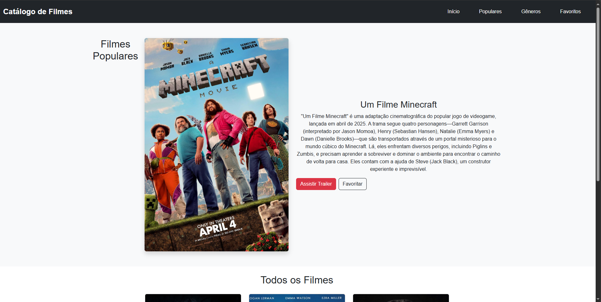
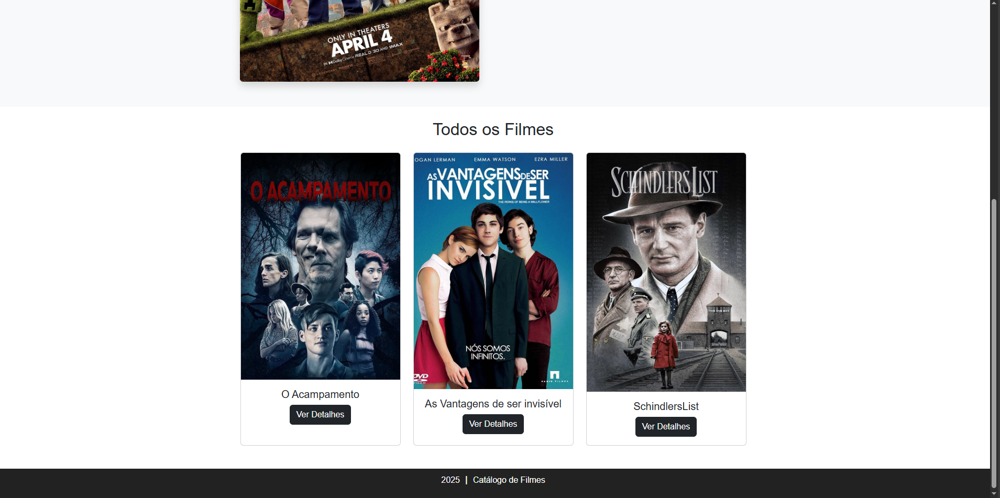
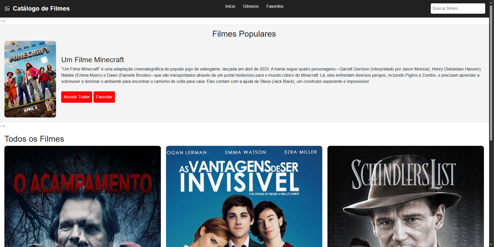
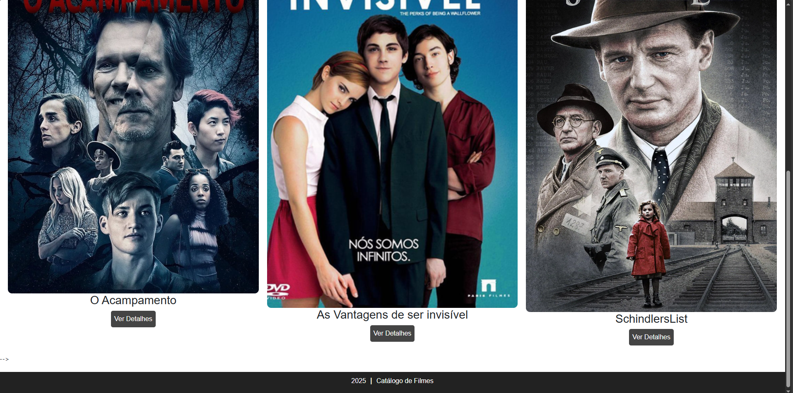
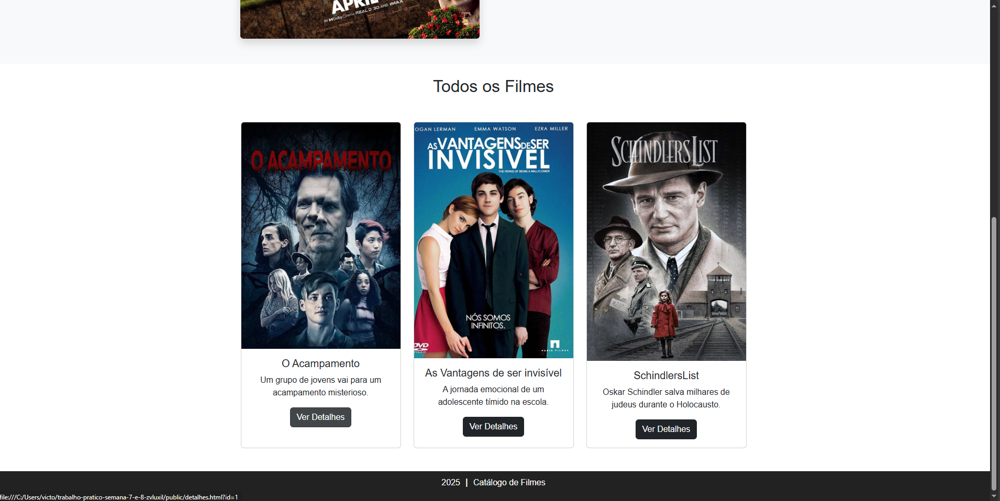
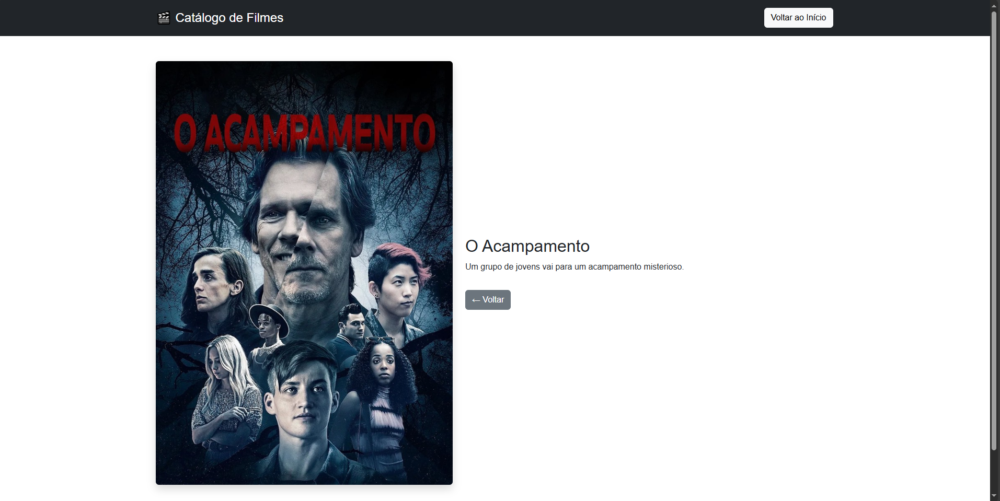
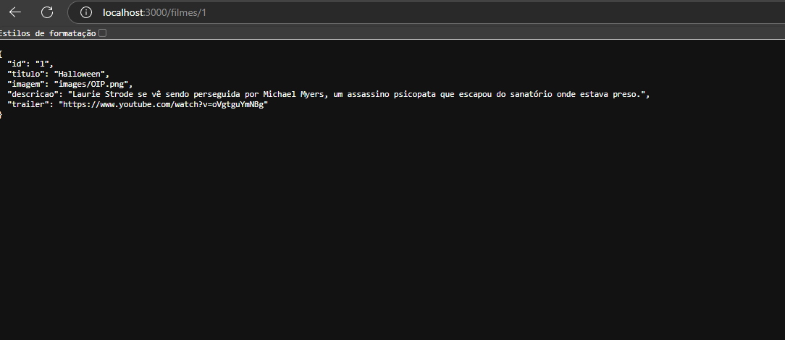
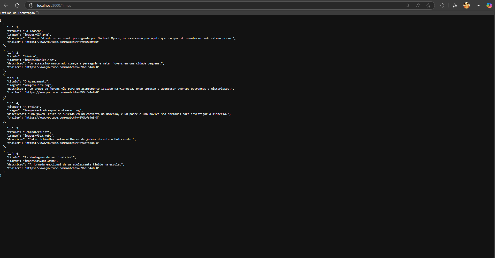
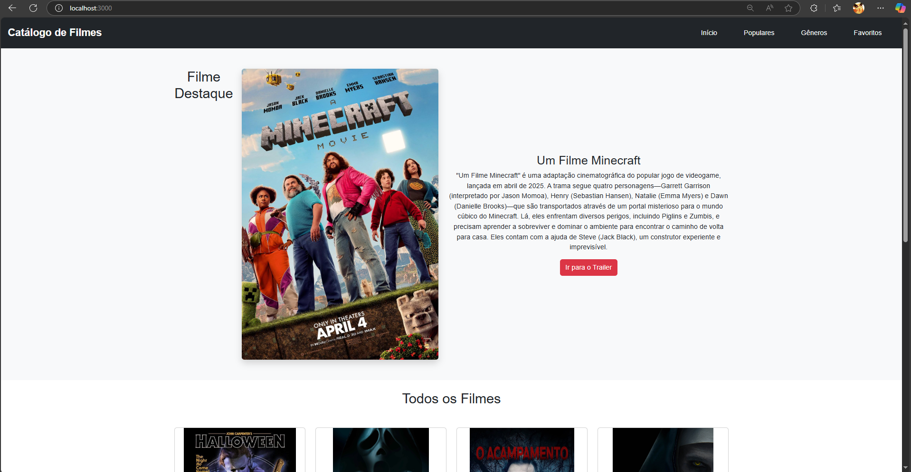
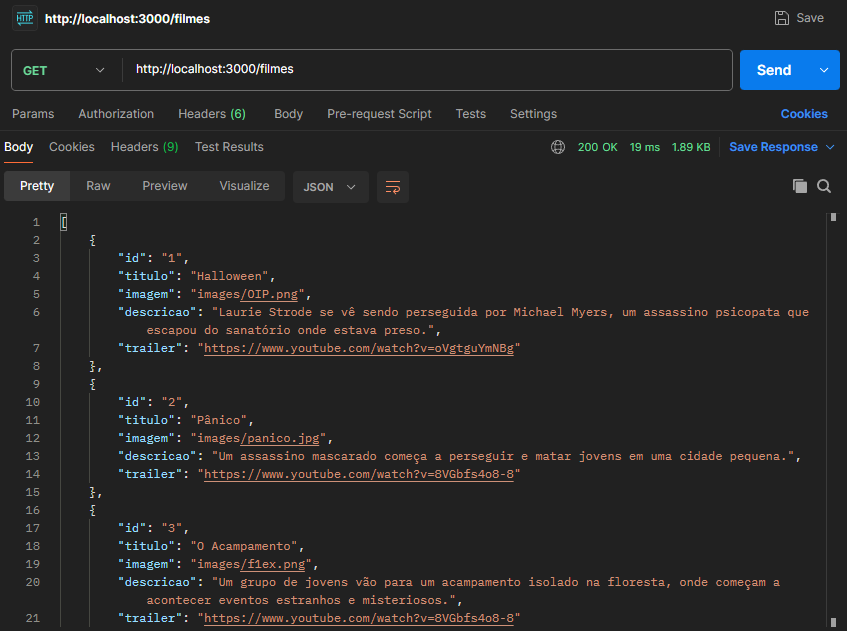
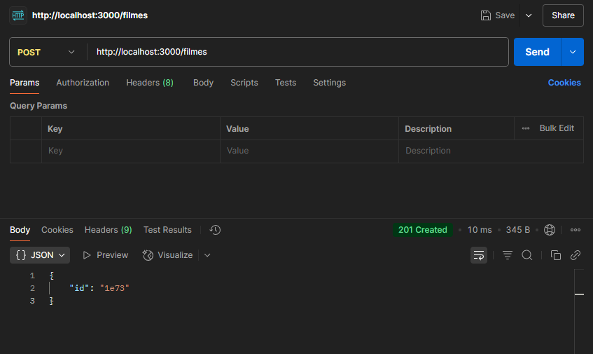

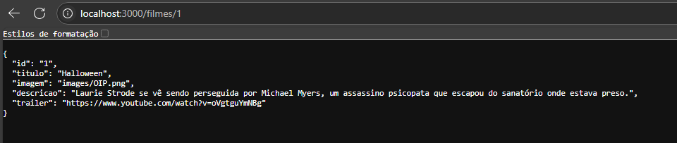
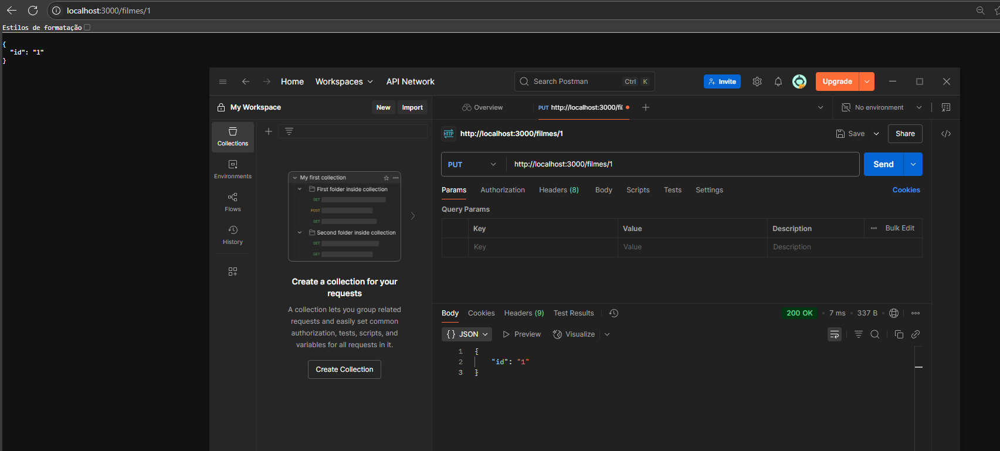
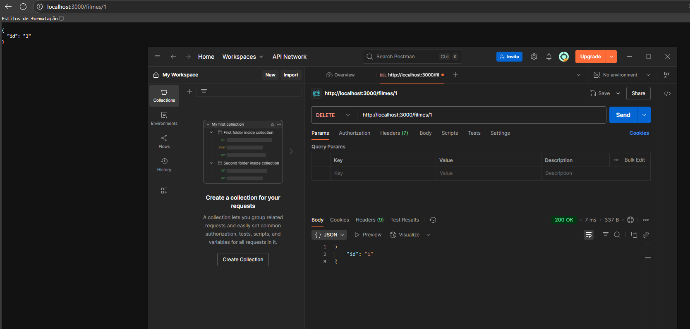
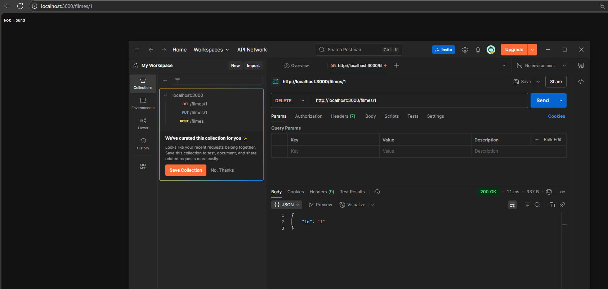
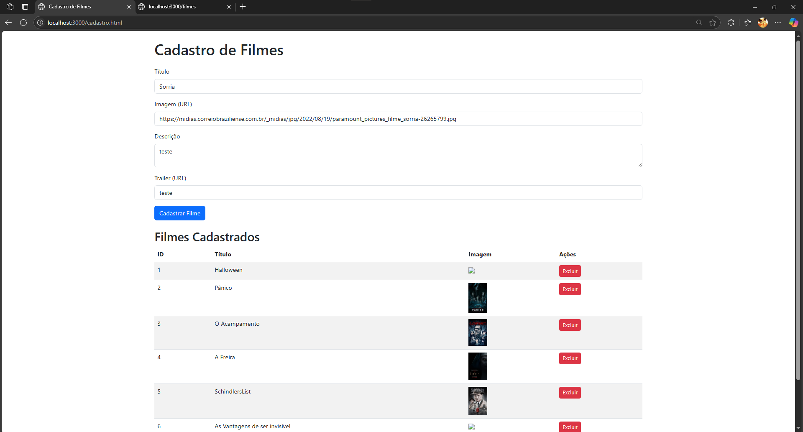
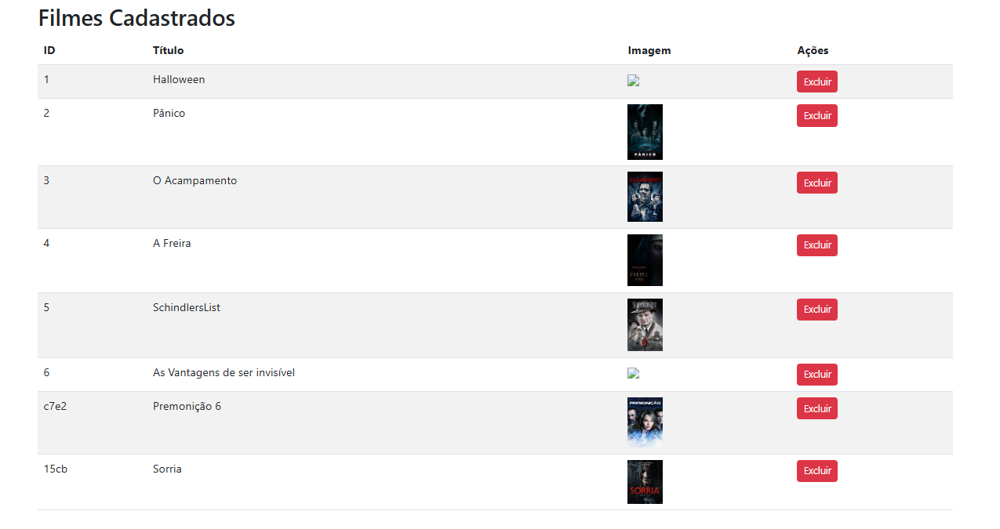
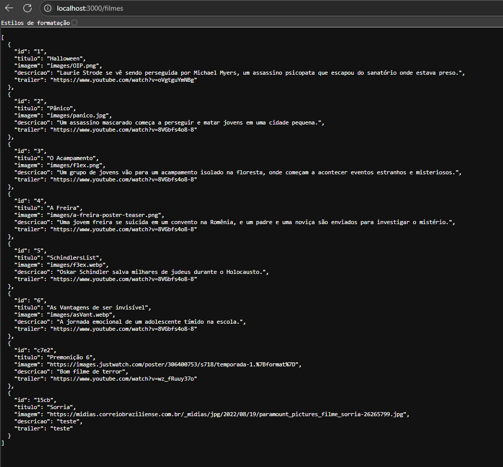

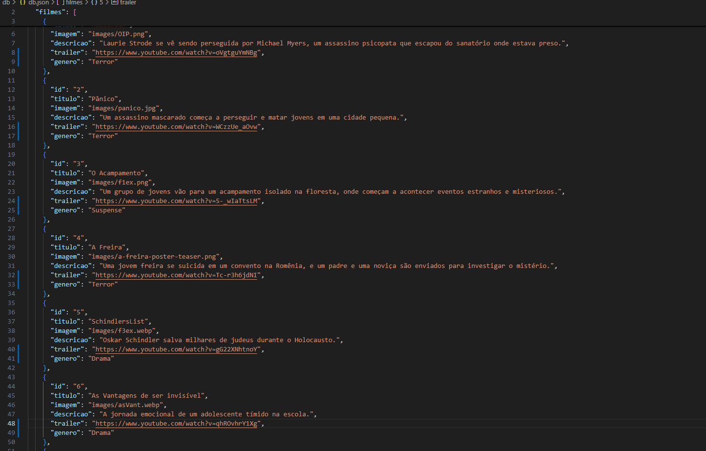
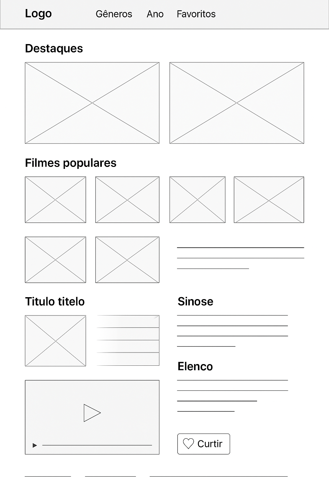
